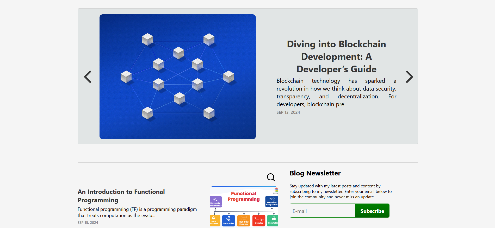
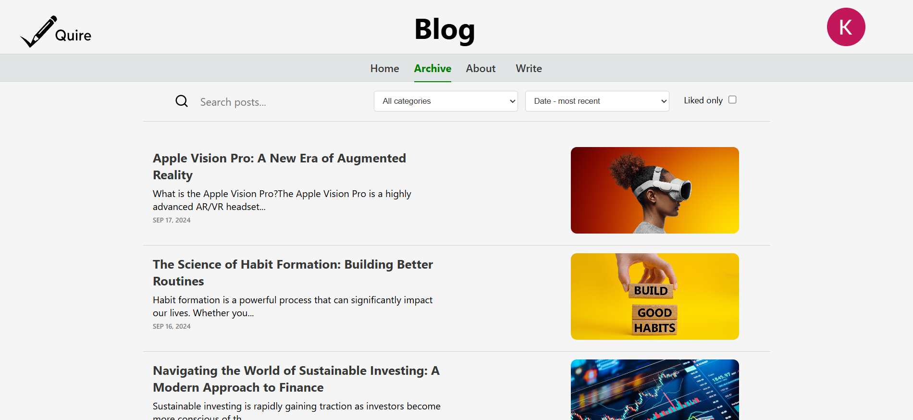
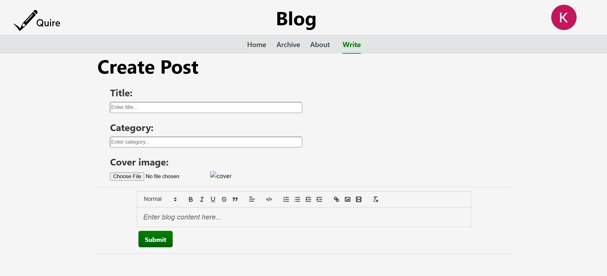

# Quire

This <b>personal blogging application </b> provides a platform for an author to create and manage his blog posts. Other users can sign in, read the posts and leave feedback through likes and comments.

 

 
 

I developed it as part of the "Fundamentals of Web Design" course at the FCSE. It serves as a practical demonstration of my web development skills at the time. The technologies used are React and Firebase, as well as react-router for routing, quill as an editor, etc.

## Quick start
### 1. Clone the repository
git clone https://github.com/kiril232/quire

### 2. Install dependencies
npm install

### 3. Run in development mode
npm start

### OR
### 3. Build for production
npm run build

### 4. Serve the production build locally
npx serve build

## Writing an article
When logged in as an authorized user, Write section gets added to the navbar where you can create the article using the Quill editor:

